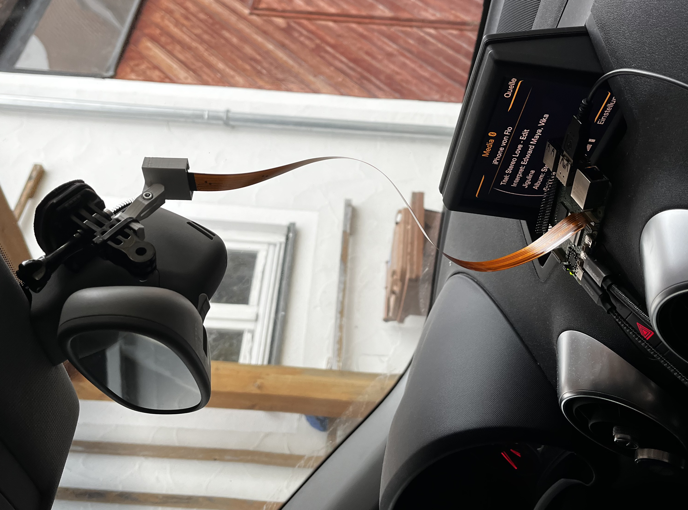
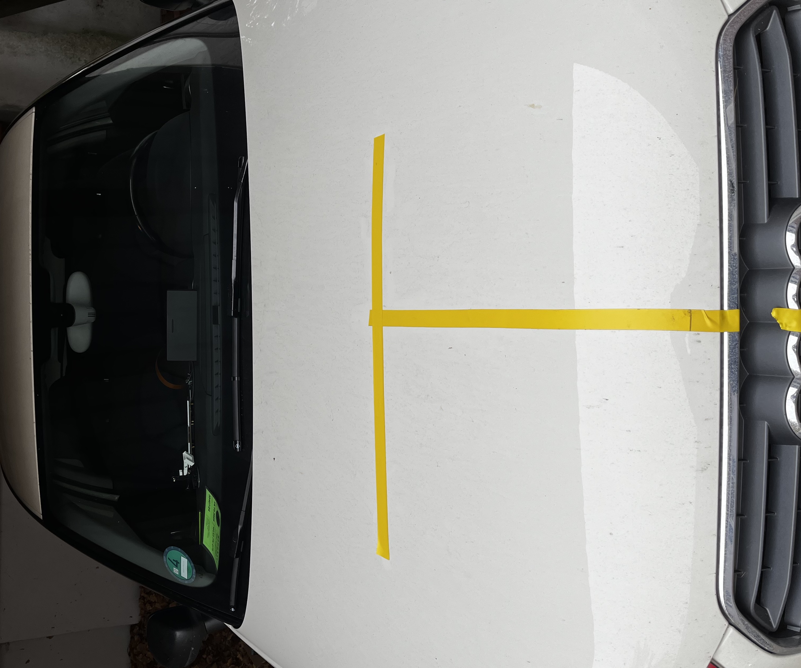
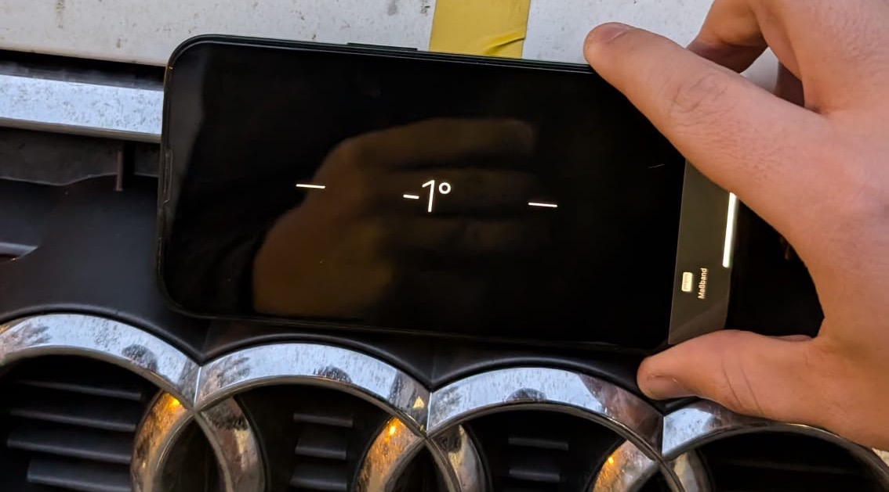
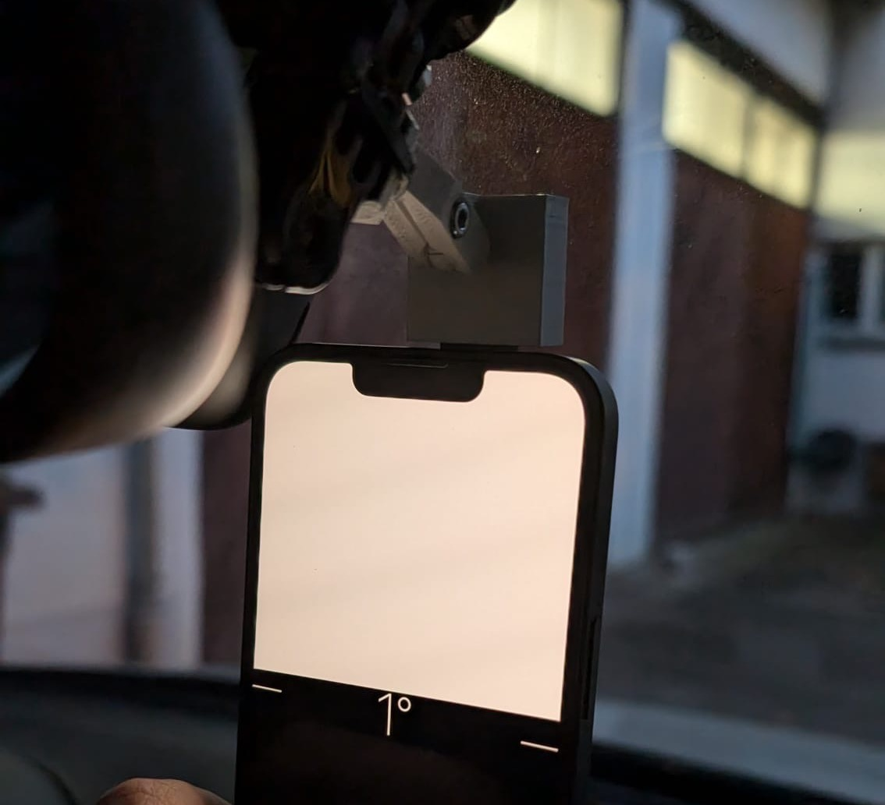
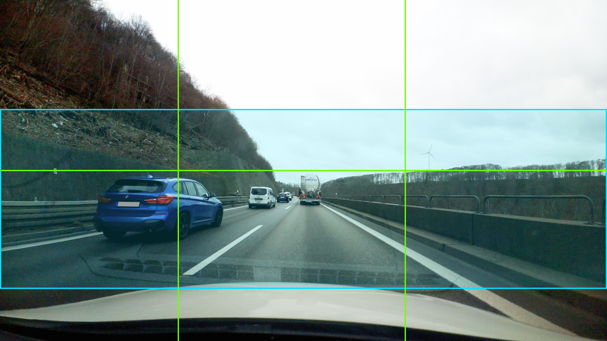

# Hardware Setup Documentation - Neural-Navi

## System Configuration

### Computing Platform
- **Device**: Raspberry Pi 5 (8GB RAM)
- **OS**: Raspberry Pi OS (64-bit)
- **Python**: 3.11+
- **Storage**: 32GB microSD Class 10

### Camera System Implementation


#### Camera Setup
- **Hardware**: Raspberry Pi Camera Module
- **Library**: PiCamera2
- **Resolution**: 1920x1080 @ 30 FPS
- **Mounting Position**: Dashboard center, windshield height
- **ROI Configuration**: (0, 320, 1920, 575) for highway scenarios

### OBD-II Interface Implementation
- **Adapter**: ELM327 Bluetooth
- **Device MAC**: `66:1e:32:f9:c0:32` (device-specific)
- **Protocol**: OBD-II Mode 01 + Mode 22 (custom commands)
- **Connection**: RFCOMM Bluetooth Serial (`/dev/rfcomm0`)

### Vehicle Integration
- **Test Vehicle**: Audi A1 8X (VAG Group)
- **OBD Port**: Standard ELM327 16-pin connector
- **Power**: 12V vehicle power system

## Installation Process

### System Dependencies
```bash
sudo apt update && sudo apt upgrade -y
sudo apt install python3-pip python3-venv python3-opencv
sudo apt install python3-picamera2 libcamera-tools
```

### VSCode Installation
Installed VSCode 1.96.2 for ARM64 due to stability requirements:
```bash
wget https://update.code.visualstudio.com/1.96.2/linux-deb-arm64/stable -O code_1.96.2_arm64.deb
sudo dpkg -i code_1.96.2_arm64.deb
sudo apt install -f
```
Other versions of VSCode regularly crashed on the raspberry pi

### Project Environment Setup
```bash
cd ~
git clone https://github.com/floriankulig/neural-navi.git neural-navi
cd neural-navi
python3 -m venv venv --system-site-packages
source venv/bin/activate
pip install -e .
```

### Automated Setup Function
Created bash function for development workflow:
```bash
setup() {
    cd ~/neural-navi
    source venv/bin/activate
    alias py=python
    sudo rfcomm bind rfcomm0 66:1e:32:f9:c0:32
    echo "Neural-Navi environment ready"
}
```

## Camera Mounting and Calibration





### Physical Installation
- **Position**: Dashboard center mount
- **Orientation**: Horizontal alignment with slight downward angle
- **Stabilization**: Vibration-resistant mounting system
- **Cable Routing**: Clean integration with vehicle interior

### Calibration Implementation

- **Reference System**: Yellow tape markers on vehicle exterior
- **ROI Determination**: Live calibration using camera.py script
- **Exposure Control**: Automatic adjustment for lighting conditions




### ROI Configuration
```python
DEFAULT_IMAGE_ROI = (0, 320, 1920, 575)  # Highway-optimized crop
DEFAULT_IMAGE_FOCUS = (680, 393, 560, 424)  # Autofocus region
```

## OBD-II Interface Configuration

### Bluetooth Pairing Process
```bash
sudo bluetoothctl
pair 66:1e:32:f9:c0:32
trust 66:1e:32:f9:c0:32
connect 66:1e:32:f9:c0:32
```

### RFCOMM Binding Configuration
```bash
echo 'rfcomm0 {
    bind yes;
    device 66:1e:32:f9:c0:32;
    channel 1;
    comment "ELM327 OBD Adapter";
}' | sudo tee /etc/bluetooth/rfcomm.conf
```

### System Optimization
```bash
# GPU memory allocation for camera performance
echo 'gpu_mem=128' | sudo tee -a /boot/config.txt

# CPU governor configuration
echo 'performance' | sudo tee /sys/devices/system/cpu/cpu*/cpufreq/scaling_governor
```

## Data Synchronization Setup

### Capture Configuration
- **Frequency**: 2 Hz (500ms intervals)
- **Synchronization**: Image and telemetry timestamp alignment
- **Precision**: Microsecond-level timing correlation

### Implementation Details
- **Camera Thread**: PiCamera2 capture loop
- **Telemetry Thread**: OBD-II polling via python-obd
- **Coordination**: Shared timestamp system for multimodal alignment

## Recording Implementation

The implemented recording system captures:
- **Images**: JPG format with timestamp filenames
- **Telemetry**: CSV format with synchronized timestamps
- **Annotations**: YOLO detection results post-processing
- **Labels**: Future brake/coast event labels for training

Recording sessions stored in timestamped directories under `data/recordings/`.